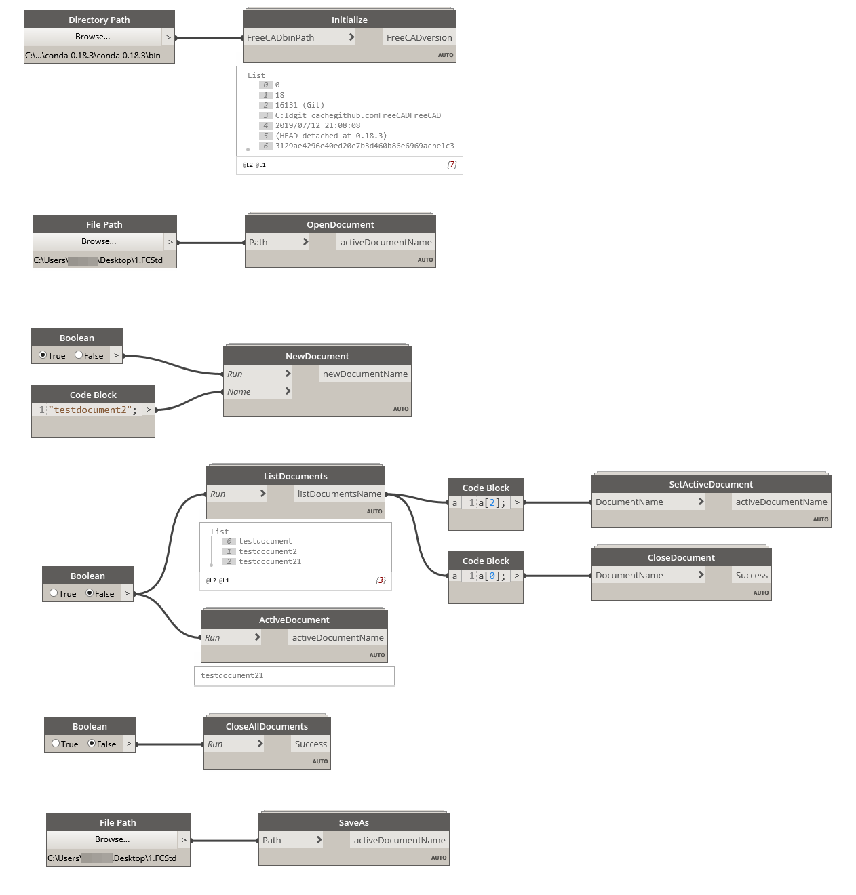
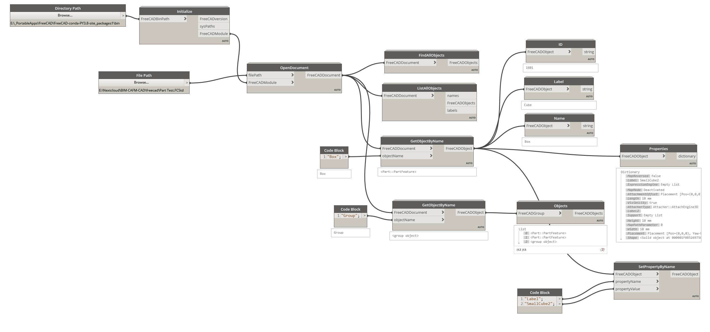
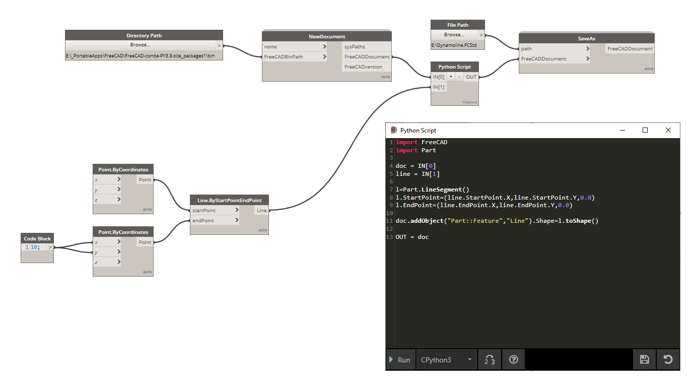

 
# DynFreeCAD

Dynamo nodes for the FreeCAD API

**Early, work in progress**, PRs are welcomed!

## Requirements

- Dynamo 2.8+. Download from [dynamobuilds.com](https://dynamobuilds.com/)

- FreeCAD built with python 3.8.
  
  - Download a prebuilt from here (0.19): [Release FreeCAD Win Conda PY3.8 · sgrogan/FreeCAD · GitHub](https://github.com/sgrogan/FreeCAD/releases/tag/PY3.8) The 'site_packages1' version works better.
  
  - You can build yourself a different verision, follow FreeCAD's doumentation

## Installation

- Clone this repo

- Open DynamoSandbox.exe

- Settings ➡ Manage Node and  Package Paths... ➡ Add a new folder with ➕, select the `Dyf` subfolder from where you cloned ➡ Accept changes

- (Dynamo package manager soon!)

### FreeCAD API in Dynamo

Dynamo 2.7 added support for CPython 3.7, so FreeCAD can be called inside dynamo. Everything should work inside Python nodes, I want to add more common FreeCAD commands as nodes, so graphical programming can get a boost in FreeCAD.

Unfortunately due to a bug in Dynamo 2.7, these nodes are only usable in 2.8 with Python 3.8. 

### Compatibility matrix

Table updated: 2020-09-07

| Dynamo | cPython in Dynamo | FreeCAD API | DynFreeCAD | Revit  |
| ------ | ----------------- | ----------- | ---------- | ------ |
| 2.6    | ❌                 | ❌           | ❌          | 2021.1 |
| 2.7    | 3.7               | ✔           | ❌          | ❌      |
| 2.8    | 3.8               | ✔           | ✔          | ❌      |
| 2.9    | 3.8               | ✔           | ✔          | ❌      |

## Usage and tips

⚠️<b>As DynFreeCAD is under developement, it's possible that some screenshots and documentation are outdated</b>⚠️

Detailed documentation is in the [wiki](https://github.com/infeeeee/DynFreeCAD/wiki). 

See `Examples` folder for some Dynamo documents.

### Open or create a new document

Always start with these nodes. Add the path to the `bin` folder of FreeCAD.

### Manage documents

Use the ouput of the OpenDocument or CreateDocument nodes output if you just work on one document. The bottom nodes just showing how these nodes are connectable. 

### Manage properties

### Python script

You can use the FreeCAD API in a Python Script this way:

See UseTheApi.dyn in Examples folder.

## Troubleshooting

If you have some problems, open an issue!

You can also ask questions on the related project's forums:

- [Dynamo Forum](https://forum.dynamobim.com/)
- [FreeCAD Forum](https://forum.freecadweb.org/)
- [OSArch Community](https://community.osarch.org/)

## License

MIT
