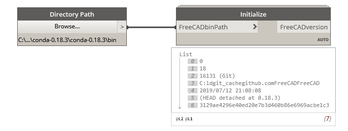
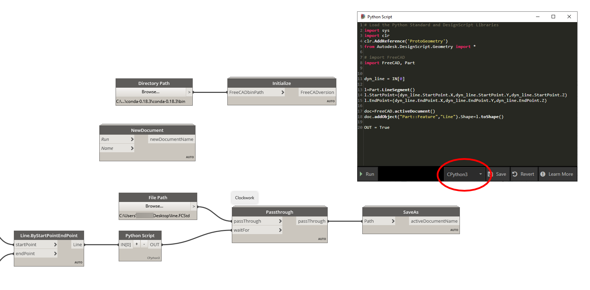

# DynFreeCAD

Dynamo nodes for the FreeCAD API

**Early ,work in progress**, PRs are welcomed!

## Requirements

- Dynamo 2.8+. Download from [dynamobuilds.com](https://dynamobuilds.com/)

- FreeCAD built with python 3.8.
  
  - Download a prebuilt from here (0.19): [Release FreeCAD Win Conda PY3.8 · sgrogan/FreeCAD · GitHub](https://github.com/sgrogan/FreeCAD/releases/tag/PY3.8)
  
  - You can build yourself a different verision, follow FreeCAD's doumentation

## Installation

- Clone this repo

- Open DynamoSandbox.exe

- Settings ➡ Manage Node and  Package Paths... ➡ Add the folder with ➕ where you cloned ➡ Accept changes

- (Dynamo package manager soon!)

## Usage and tips

Dynamo 2.7 added support for CPython 3.7, so FreeCAD can be called inside dynamo. Everything should work inside Python nodes, I want to add more common FreeCAD commands as nodes, so graphical programming can get a boost in FreeCAD.

Unfortunately due to a bug in Dynamo 2.7, these nodes are only usable in 2.8 with Python 3.8. 

⚠️ **The following screenshots are OUTDATED** ⚠️ 

TODO: update screenshots

### Initialize FreeCAD

Always start with these node. Add the path to the `bin` folder in the FreeCAD folder. After you initialized somewhere in the graph, you can simply use `import FreeCAD` in any nodes:

### Manage documents

If you want to update the list nodes, connect a Boolean node to the Run input, and change to True or False

### Python script

You can use the FreeCAD API in Python Script this way:

This creates a line from a dynamo line in FreeCAD, than saves the document.
